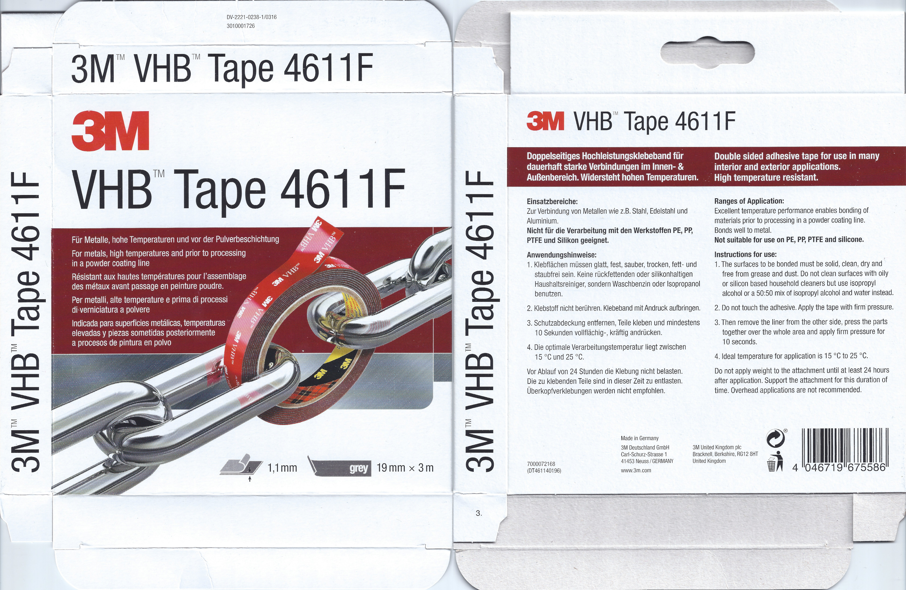
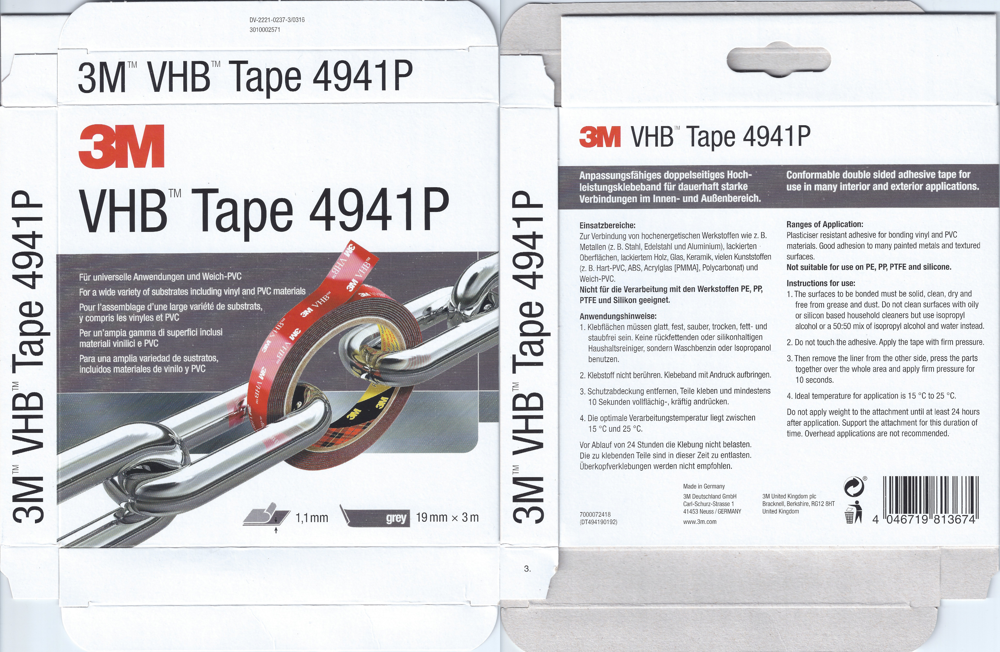
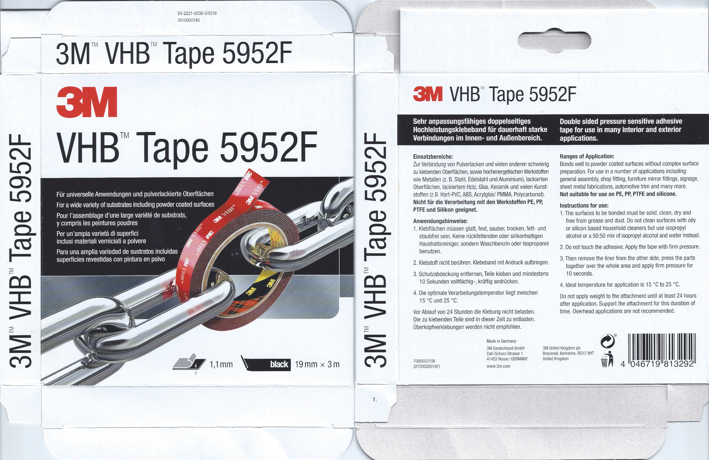

Very High Bond (VHB) tape
=========================

3M produce a huge array of VHB tapes for commercial use. However, for retail customers, they produce just three main types - 4611F, 4941P and 5952F.

For whatever reason, in their English instructions, they really only make clear the materials with which you should **not** use these tapes. None of them are suitable for use with PE, PP, PTFE or silicone.

It's only if you look at the German instructions on the packaging that the differences between the three are clear. In the German instructions, they list with which materials you should use each tape.

4611F is the least general purpose - it is only recommended for use with "metals such as steel, stainless steel and aluminium".

4941P and 5952F are very similar and much more general purpose.

4941P is recommended for use with "high-energy materials such as metals (e.g. steel, stainless steel and aluminum), painted surfaces, painted wood, glass, ceramics, many plastics (e.g. rigid PVC, ABS, acrylic glass [PMMA], polycarbonate) and soft PVC."

5952F is recommended for an almost identical set of material, except that it is not recommended for use with **soft** PVC. However, it is recommended for an additional category of materials - i.e. for "powder coatings and many other surfaces that are difficult to bond".

5952F seems to the most general-purpose and is the type that I use - unless you have to work with soft PVC, there seems to be no reason to choose one of the other types.

Note: "hochenergetischen Werkstoffen"/"high-energy materials" is an odd term in both German and English. If you search elsewhere, you'll find that 3M define it as meaning "gut zu verklebende Substrate", i.e. "substrates that are easy to bond".

Below, you can find scans of the packaging for all three types with their recommended areas of use in German along with an English translation from [DeepL](https://www.deepl.com/translator).

English notes
-------------

The "ranges of application" notes on the packaging, in English, aren't as comprehensive as those in German and are less consistent across the different types. But _perhaps_ the narrower wording gives a clearer idea as to the intended usage, i.e. that 4611F is for uncoated materials, in particular metal, 4941P is for vinyl and PVC materials and 5952F is for coated materials and has a wide range of applications.

4611F: "Excellent temperature performance enables bonding of materials prior to processing in a powder coating line. Bonds well to metal."

4941P: "Plasticiser resistant adhesive for bonding vinyl and PVC materials. Good adhesion to many painted metals and textured surfaces."

5952F: "Bonds well to powder coated surfaces without complex surface preparation. For use in a number of applications including: general assembly, shop fitting, furniture mirror fittings, signage, sheet metal fabrications, automotive trim and many more."

Where to buy
------------

I recommend you buy these tapes from a large hardware store, with proper supply chain management, rather than from Amazon. These tapes are usually sold by third parties on Amazon and it's very unclear what exactly you're getting - some are reselling non-genuine tape from Chinese firms.

In particular, the biggest third party seller at one stage was an American company that had worked out that the markup on the tape for retail customers was so large that they could buy huge rolls at wholesale prices and unroll these, cutting them down to the standard retail length of 10ft and rerolling them. It _may_ be perfectly possible to do this without any negative effect on the tape - but I don't know and I'd rather have the option to clearly choose between tape produced in such a way and tape in its original retail packaging from 3M.

On Amazon UK, it's interesting to see that confusion about the different types of tape has led to bad "herding". By _herding_ I mean "if you don't know what to buy then buy what everyone else is buying". On Amazon US, the most general purpose of the three tapes, i.e. 5952F, is by far the most popular. However, on Amazon UK, the least general-purpose type, i.e. 4611F, is the most popular - I suspect that this doesn't reflect an unusual demand for bonding just steel, stainless steel and aluminum but reflects confusion about the differences between the types and people simply choosing the variety that others have chosen (with some odd initial purchasing bias resulting in the current situation).

4611F
-----

DE:

> Zur Verbindung von Metallen wie z.B. Stahl, Edelstahl und Aluminium. Nicht für die Verarbeitung mit den Werkstoffen PE, PP, PTFE und Silikon geeignet.

EN:

> For joining metals such as steel, stainless steel and aluminium. Not suitable for use with the materials PE, PP, PTFE and silicone.

4941P
-----

DE:

> Zur Verbindung von hochenergetischen Werkstoffen wie z. B. Metallen (z. B. Stahl, Edelstahl und Aluminium), lackierten Oberflächen, lackiertem Holz, Glas, Keramik, vielen Kunststoffen (z. B. Hart-PVC, ABS, Acrylglas [PMMA], Polycarbonat) und Weich-PVC. Nicht für die Verarbeitung mit den Werkstoffen PE, PP, PTFE und Silikon geeignet.

EN:

> For joining high-energy materials such as metals (e.g. steel, stainless steel and aluminum), painted surfaces, painted wood, glass, ceramics, many plastics (e.g. rigid PVC, ABS, acrylic glass [PMMA], polycarbonate) and soft PVC. Not suitable for use with the materials PE, PP, PTFE and silicone.

5952F
-----

DE:

> Zur Verbindung von Pulverlacken und vielen anderen schwierig zu klebenden Oberflächen, sowie hochenergetischen Werkstoffen wie Metallen (z. B. Stahl, Edelstahl und Aluminium), lackierten Oberflächen, lackiertem Holz, Glas, Keramik und vielen Kunststoffen (z.B. Hart-PVC, ABS, Acrylglas [PMMA], Polycarbonat). Nicht für die Verarbeitung mit den Werkstoffen PE, PP, PTFE und Silikon geeignet.

EN:

> For bonding powder coatings and many other surfaces that are difficult to bond, as well as high-energy materials such as metals (e.g. steel, stainless steel and aluminum), painted surfaces, painted wood, glass, ceramics and many plastics (e.g. rigid PVC, ABS, acrylic glass [PMMA], polycarbonate). Not suitable for use with the materials PE, PP, PTFE and silicone.
